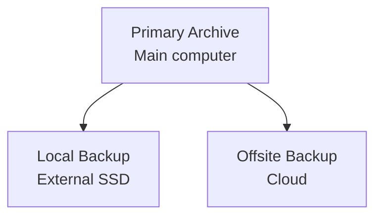
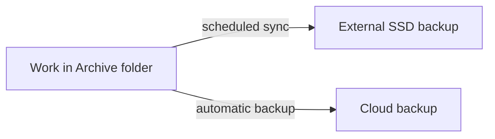
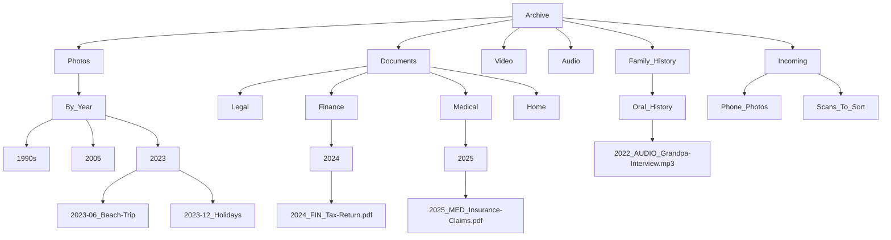

<style>
    h1 { font-size: 2rem; }
    h2 { font-size: 1.6rem; }
    h3 { font-size: 1.6rem; }
    h4 { font-size: 1.4rem; }
    h5 { font-size: 1.3rem; }
    h6 { font-size: 1.3rem; }
</style>

# Personal Digital Archives: What They Are, Why They Matter, and How to Build One

## 1. Introducing the Personal Digital Archive

We're all accumulating stuff: photos, documents, videos, records. Some of it started digital, some of it's still sitting in shoeboxes or on old CDs gathering dust. And increasingly, it's everywhere: your phone, your laptop, three different cloud services, buried in email attachments, and yes, still in those actual boxes in the closet.

The tricky thing is that this problem sneaks up on you. Devices die or get replaced. Services shut down or change their terms. You forget passwords. Old media formats become unreadable. One day you need to find something important (a photo, a document, proof of something) and you realize you have no idea where it actually lives, or if it even still exists.

A Personal Digital Archive is my answer to this mess. It's not about getting excited over technology for its own sake. It's about having clarity about what you have, protecting it from loss, and making sure it'll still be there (and accessible) when you need it.

In this post, I'm going to walk you through what a Personal Digital Archive actually is, why it matters, and how to build one yourself without needing to be particularly technical.

---

## 2. What Is a Personal Digital Archive?

Here's the simple version: it's one place for your important digital stuff, organized well enough that you can actually find things later, protected against the various ways things can go wrong, and set up so that someone else could take over if they needed to.

A Personal Digital Archive typically includes photos, documents, video, and audio files: both the things you already have digitally and scanned versions of physical items that matter. It also includes context files that explain what things are and why they matter, because a photo of people you can't identify or a document with no explanation isn't particularly useful years from now.

The whole point is to build a system that can survive change. New devices, new software, your own failing memory, and eventually, someone else having to figure out what you've left behind.

---

## 3. The Problems a Personal Digital Archive Solves

Most people don't lose their digital history all at once in some dramatic disaster. They lose it through boring, predictable failure modes that happen gradually.

Device failure, theft, fire, or flood can wipe things out. So can getting locked out of your own accounts because you forgot a password or lost your phone and can't do two-factor authentication anymore. Disorganization is its own form of loss. If you have thousands of files with names like "IMG_4372.jpg" scattered across folders, good luck finding the one you need. Old formats become unreadable. Physical media degrades. And ransomware or compromised accounts can encrypt or delete everything before you even notice.

Then there's the problem nobody likes to think about: what happens when you're gone, or just temporarily unavailable? If you're the only person who knows where anything is or how to access it, that knowledge disappears with you.

A Personal Digital Archive is designed to make all of these problems survivable. Not through some complicated technical solution, but through simple, deliberate organization and redundancy.

---

## 4. Core Principles (Before Tools or Products)

Before we get into the specifics of how to actually build this thing, let's talk about principles. These matter more than any particular piece of software or service you might use.

Think about safety and clarity, not tools. The goal is protecting what matters and making it findable, not having the fanciest setup.

Maintain one main archive, not a bunch of scattered "important" folders across different drives and services. Consolidation is your friend.

Keep extra copies for protection. This is non-negotiable.

Design for survivability and handoff. It needs to work when you're not around to explain it.

And here's a useful rule: if your system is too complex to explain to someone else in a few minutes, it's probably too complex to rely on. Simplicity isn't laziness; it's resilience.

---

## 5. Step-by-Step: Building a Personal Digital Archive

### Step 1 — Create the "Virtual Vault" (Preserve and Protect)

Before you organize files or scan photos, you need a safe place for everything to live. This foundation matters more than any later step. An archive that's beautifully organized but easy to lose or impossible to recover isn't really an archive at all.

Think of this step as building a virtual vault: a simple, well-defined home for your most important digital materials, designed to survive accidents, failures, and mistakes.

---

#### The 3-2-1 principle (in plain language)

There's a widely used guideline for protecting important data called the 3-2-1 rule. It goes like this: keep three copies of your data, on two different types of storage, with one copy stored offsite.

This rule describes outcomes, not specific products. There are lots of valid ways to satisfy it. What matters is that no single failure (hardware dying, software bugs, ransomware, your own mistakes) can wipe everything out at once.

---

#### Visual overview: the Virtual Vault



---

#### One concrete example configuration

Let me show you one specific setup I use personally. This is offered as an illustration to make things concrete, not as the only way to do this.

##### The primary archive (your source of truth)

All my important materials live in a single top-level folder called `Archive`. This folder sits on my main computer, and it's treated as the authoritative version of everything.

Why this matters: everything important lives in one known place. Backups are simpler and more reliable because there's only one thing to back up. And it's easy to explain to someone else later. "Everything's in the Archive folder."

---

##### A local backup on separate hardware

A full copy of the Archive folder is stored on an external SSD. The drive is encrypted, and I don't leave it permanently connected to my computer.

The archive gets synchronized to this drive using a scheduled mirror-style sync tool, which creates an exact, readable copy rather than some proprietary backup format.

Why this matters: it protects against my internal drive failing. It reduces ransomware exposure when the drive is disconnected. And if I need to, I can browse the files directly on the backup drive without special software.

---

##### An offsite backup for disaster recovery

My computer is continuously backed up to a cloud backup service. This means the Archive folder (along with everything else) is being backed up automatically to the cloud.

Why this matters: it covers the really bad scenarios. Fire, flood, theft, or my computer just completely dying. It provides version history so I can recover deleted or corrupted files. And it requires almost no ongoing effort once it's configured.

---

#### How updates propagate



When I add something to the Archive folder, it automatically gets backed up to the cloud within a few minutes or hours (depending on file size). The external SSD gets updated on a schedule, usually daily or weekly depending on how much I'm adding.

---

#### Encryption and security

Both my computer and the external backup drive are encrypted. This isn't about paranoia; it's about risk reduction. If a device is lost or stolen, encryption turns a potential privacy disaster into a non-event. Modern operating systems make this straightforward, and it should be considered part of any serious archive.

---

#### Ransomware considerations

Ransomware is one reason at least one copy of your archive should not be continuously writable. An external drive that's only connected during backups, or a cloud backup service with version history, provides meaningful protection without adding complexity.

You don't need to obsess over this, but it's worth designing around.

---

#### Valid variations on this setup

This is just one way to implement the principle. Other approaches can work just as well. Some people use two rotating external drives instead of one. Some people have a network-attached storage device. Some people prefer different cloud backup providers.

The point is: three copies, two types of storage, one offsite. How you get there is less important than actually getting there.

Once this foundation is in place, you can move on confidently to adding and organizing content, knowing it's protected as you go.

---

### Step 2 — Add Content

With a safe foundation in place, the next step is to begin populating the archive. This is where many people feel overwhelmed, often because they assume everything needs to be done at once, or done perfectly.

Neither is true.

The goal here is simple: get important material into the archive in a usable, durable form. Refinement can come later.

---

#### 2.1 Collect existing digital content

Start with content that already exists digitally. This is usually the fastest progress you'll make.

Typical sources include smartphone photos and videos, documents you already have as PDFs, and existing folders you already rely on for taxes, insurance, home records, or family history.

A few practical guidelines: focus first on high-value and hard-to-replace material. Don't reorganize as you collect. Just get things into the archive. And preserve original files whenever possible instead of converting or reprocessing them right away.

A useful pattern is to create temporary "incoming" folders inside the archive (something like `Archive/Incoming/Phone_Photos`) and sort them later. Momentum matters more than neatness at this stage.

---

##### Choosing durable file formats (guidance, not rules)

As you add content to your archive, file formats matter. Some formats are more likely than others to remain readable and usable over long periods of time.

The goal isn't to standardize everything immediately, but to make good choices when you have a choice, especially when creating new files or digitizing physical materials.

In general, prefer formats that are widely supported, well documented, and not tied to a single vendor or application. Proprietary formats aren't forbidden, but they should be treated with caution.

---

###### Photos and images

For long-term preservation, TIFF is high quality, non-lossy, and widely supported. DNG is an open raw format that's especially appropriate if you're doing camera-based scanning.

JPEG and PNG are also acceptable. JPEG is extremely common and will be around forever. PNG is good for screenshots, graphics, and images with text.

Practical guidance: preserve original captures when possible. Avoid repeatedly re-saving lossy formats like JPEG, which degrades the image each time. Keep higher-quality "master" files for high-value or irreplaceable photos.

JPEG images are perfectly reasonable for most everyday use. TIFF or DNG matter most for photos that you might later want to restore or print at high quality.

---

###### Documents and text

For documents, PDF is stable and widely supported. PDF/A is specifically designed for long-term archiving, but standard PDF is still a strong choice.

Plain text (.txt) and Markdown (.md) are also good for notes, narratives, and README files that add context to your archive.

When you scan documents, scan to PDF when possible and use OCR so the documents are searchable. Avoid formats that require a specific application or subscription to open.

PDF/A is ideal when you have the option, but don't stress about it. Standard PDF is still very good.

---

###### Tabular data and spreadsheets

For tabular data (financial records, inventories, logs, or lists) prefer CSV (Comma-Separated Values) or TSV (Tab-Separated Values).

These formats are simple and human-readable. They can be opened by many different tools. And they avoid long-term lock-in to a specific spreadsheet application.

If you create or maintain data in a proprietary spreadsheet format, consider exporting a CSV version for the archive as well.

---

###### Video and audio

General guidance: use widely supported formats. Favor formats that can be played without specialized software.

Common examples include MP4-based formats for video, and WAV or high-quality MP3 for audio.

As with photos, keep originals when possible, but prioritize usability and accessibility.

---

###### A simple rule of thumb

Here's a useful test: if you can open the file easily on a different computer without installing special software, it's probably a good archival choice.

This guidance is about reducing future friction, not enforcing rigid rules.

---

#### 2.2 Digitize physical items (photos and documents)

Many of the most meaningful materials still exist only on paper: printed photos, letters, certificates, receipts, notebooks, and records that may already be fading.

Digitization preserves fragile originals, makes materials searchable and shareable, and allows them to be backed up like any other digital file.

I'm not going to attempt a detailed comparison of scanning technologies here. That could be its own article. There are smartphone scanning apps, feed scanners, flatbeds, and camera-based approaches. What matters is choosing an appropriate method for what you're trying to preserve.

---

##### A practical, multi-pass approach to photo digitization

Here's how I think about photo digitization.

First pass: coverage. Aim for speed and completeness. Scan prints at 600 DPI. A good feed scanner provides "good enough" results for most photos. The goal is to get everything digitized, not to create museum-quality scans.

Second pass: high-value photos. Selectively rescan important photos using a quality flatbed or camera-based setup. Create higher-quality preservation or print masters for the photos that really matter.

Special cases: mounted, framed, or fragile photos need special handling. Items that could be damaged by rollers or pressure shouldn't go through a feed scanner. For these, a touchless camera-based scanning approach is often safest.

The guiding principle is to match the scanning method to the condition and importance of the original.

---

#### 2.3 Convert video and legacy media

Older media formats (VHS tapes, camcorder tapes, DVDs) require active intervention before they become completely unplayable.

Why conversion matters: playback equipment becomes scarce and expensive. Physical media degrades over time. And digital files can be backed up and shared easily.

Practical guidance: convert to a widely supported format (commonly MP4). Keep the converted files in the archive. And don't delay indefinitely in pursuit of perfect settings. A usable copy now is better than an ideal copy that never happens.

---

#### A mindset that helps

Digitization and content gathering are not one-time events. They're incremental processes.

Start by getting material safely into the archive in reasonable formats. You can improve quality later where it matters. Once content is inside the archive, it can be protected, organized, enhanced, and most importantly, found.

The next step focuses on exactly that: making what you've gathered understandable and navigable over time.

---

### Step 3 — Organize for Long-Term Use

Once content is safely inside the archive, organization becomes the most important factor in whether the archive is actually useful. This isn't about making things look tidy today. It's about making them findable and understandable years from now, possibly by someone else.

Good organization reduces cognitive load. Bad organization creates friction that causes people to stop using the archive altogether.

---

#### 3.1 Folder structure

Folders provide the primary structure of your archive. They should reflect how people naturally look for things, not how a particular application prefers to store them.

Some general guidelines: use a hierarchical structure where each folder represents a collection or sub-collection. Avoid deep or overly clever nesting. Favor clarity over compactness.

Most people search by time (year, decade), category (photos, documents, video), people or family branches, or events (trips, weddings, service, moves).

A common and durable pattern is to organize at the top level by broad category, then use subfolders organized by time, person, or event, whichever best matches the material.

There's no single "correct" structure. What matters is that it makes sense to you, and that you could explain it to someone else without a long walkthrough.



---

#### README files: adding context where folders fall short

Folders alone rarely capture the full story. Short explanatory files (often named `README.txt` or `README.md`) can add context that filenames and folder names cannot.

Useful things to include: who is in the photos, what the event was, why the folder exists, what's missing or incomplete, and any special notes someone else should know.

These files act as a quiet guide for future readers. They're especially valuable for family photos, scanned letters or documents, and collections assembled over many years.

A few short sentences can prevent a lot of confusion later.

---

#### 3.2 File naming conventions

File names matter more than most people expect. They're often the last layer of organization when files are copied, emailed, or restored outside their original folder structure.

A simple, durable pattern works best. Here's what I use:

```
YYYY-MM-DD_Category_Description.ext
```

The key points: start with a date when possible. Use a short category code from a fixed set. Add a brief, human-readable description. Avoid spaces and special characters.

Examples:
- `1998-07-04_PHOTO_Family-Picnic.jpg`
- `2023_FIN_Tax-Return.pdf`
- `2011_HOME_Roof-Repair-Receipt.pdf`

---

##### Date precision matters

Use the lowest level of precision you actually know. If you only know the year, use `YYYY`. If you know the month, use `YYYY-MM`. If you know the exact date, use `YYYY-MM-DD`.

False precision creates false confidence. An approximate date that's honest is more useful than a precise one that's wrong.

---

##### Category codes

Category codes help group related files and keep names readable.

A short, fixed list is better than an ever-growing one. For example: PHOTO, DOC, VID, AUDIO, LEGAL, FIN, MED, HOME, FAMILY.

The goal is consistency, not taxonomy perfection.

---

#### 3.3 Tagging and metadata

Folders and filenames go a long way, but they're not always enough. Especially for large photo collections.

Tags allow you to find related items across folders, group by people, places, or themes, and search without reorganizing everything.

---

##### Where tags should live

When possible, tags should be embedded in the file itself using standard metadata fields (such as IPTC/XMP for photos), rather than stored in a separate database or sidecar file.

Why this matters: embedded tags travel with the file. They survive copying, backup, and restoration. They reduce dependence on a specific application.

Sidecar files and app-specific databases can work, but they introduce fragility if files are moved or separated.

---

##### A realistic approach to tagging

Tagging everything is unnecessary and often counterproductive.

Good candidates for tagging include photos of people, major events or locations, and thematic groupings that span many folders.

As with scanning, a selective approach works best. Tags are there to reduce friction, not create more work.

---

#### A note on perfection

Organization isn't a one-time decision. It evolves as collections grow and as your understanding of what matters changes.

What matters most is that the structure is understandable, the naming is consistent, and context is captured where it would otherwise be lost.

You can refine organization over time. What you should avoid is a system so complex that you stop using it.

With content now organized, the next step is to make sure all of this can actually be recovered when needed. Something many people assume is working without ever checking.

---

### Step 4 — Verify Backup and Recovery

At this point, many people feel a sense of relief: the archive exists, it's backed up, and everything seems to be in place. Unfortunately, this is also where a false sense of safety often creeps in.

A backup that has never been tested is only a belief, not a protection.

The purpose of this step is to confirm that your archive can actually be recovered when something goes wrong, and to catch problems while they're still easy to fix.

---

#### 4.1 Confirm that backups are actually running

Start with the basics.

Is your local backup being updated when you expect it to be? Is your cloud backup actively backing up the archive folder? Are there any warnings or errors you've been ignoring?

This doesn't require deep technical knowledge. It simply means checking that files you add to the archive show up in backups, looking occasionally at backup status indicators, and not assuming "no news is good news."

If something hasn't backed up in weeks or months, it's not protecting you.

---

#### 4.2 Test a restore (this matters more than it sounds)

Many people have never tried restoring a file from backup. This is a mistake.

A simple test is enough. Pick a non-critical file from the archive and restore it from your local backup and from your cloud backup if you have one. Confirm that the file opens, the contents are intact, and the process is understandable.

You're not just testing the backup. You're testing your ability (or someone else's) to use it under stress.

If restoring a single file feels confusing or intimidating, that's valuable information. It means something needs to be simplified or documented.

---

#### 4.3 Understand version history and deletion behavior

Backups differ in how they handle changes and deletions.

Important questions to answer: If you delete a file by mistake, how long can you get it back? If a file is corrupted, are older versions available? Does your backup keep multiple versions, or just the latest copy?

This matters because many losses are logical, not physical. Accidental deletion, overwriting the wrong file, or syncing a mistake everywhere are all common problems.

Knowing your version history window lets you recover calmly instead of guessing.

---

#### 4.4 Offline or protected copies

One reason the 3-2-1 approach works is that not all copies are equally exposed.

At least one copy of your archive should be offline some of the time, or protected by versioning that can roll back unwanted changes.

This reduces risk from ransomware, software bugs, and human error propagated too quickly.

You don't need elaborate defenses. Simple separation goes a long way.

---

#### 4.5 Periodic sanity checks

Verification isn't a one-time event.

A lightweight routine is enough. Occasionally browse the archive on your backup drive. Spot-check a few files. Make sure the folder structure and names look as expected.

This does two things: it confirms that backups are healthy, and it keeps the archive familiar, which makes future recovery easier.

---

#### A useful mindset

Backups are not about preventing mistakes. Mistakes will happen.

Backups are about making mistakes survivable.

Once you know that your archive can be restored and that you understand how to do it, you can move on to optional enhancements and, more importantly, to planning for a time when you may not be the one doing the restoring.

---

### Step 5 — Content Enhancement (Optional)

At this stage, your Personal Digital Archive is already doing its most important job. Your material is gathered, organized, and protected. Everything beyond this point is about adding value, not reducing risk.

Content enhancement is optional. It should be approached selectively and thoughtfully. The goal isn't to modernize or embellish the past, but to make existing materials clearer, more usable, and more meaningful.

---

#### 5.1 Photo cleanup and restoration

Older photos often suffer from predictable issues: dust and scratches, fading or color shifts, minor blur or softness.

Light cleanup and restoration can improve legibility and viewing comfort without altering the character of the original.

Good practices: preserve the original scan untouched. Make enhancements on a copy. Avoid over-sharpening, heavy smoothing, or stylistic changes.

Restoration is most appropriate for photos that will be shared or printed, images with visible damage, and pictures where important details are hard to see.

The guiding principle is restraint. Enhancements should make the photo easier to see, not turn it into something it never was.

---

#### 5.2 OCR for scanned documents

Scanned documents are often just images of text. Optical Character Recognition (OCR) turns those images into searchable, selectable text.

Benefits include full-text search across documents, easier copying and quoting, and improved accessibility.

OCR is especially valuable for legal and financial records, medical documents, and correspondence and notes.

Accuracy varies, especially with older or degraded documents, but even imperfect OCR is often far better than none.

---

#### 5.3 Oral histories and narrative artifacts

Files alone rarely capture meaning.

Short audio recordings (sometimes called oral histories) can add context that would otherwise be lost. Who the people in a photo are. Why a document matters. Stories behind events or places.

These recordings don't need to be polished or professional. A quiet room and a few minutes of speaking is often enough.

Good candidates include family stories tied to photo collections, explanations of handwritten letters or journals, and personal reflections on important life events.

Stored alongside the related materials, these recordings become a powerful layer of interpretation.

---

#### 5.4 Adding context without rewriting history

Enhancement should never replace original material.

A good pattern is to keep the original file unchanged, add improved versions as separate files, and include short notes explaining what was done and why.

This preserves authenticity while still allowing improvement.

The archive becomes richer not by altering the past, but by making it understandable.

---

#### A note on scope

Content enhancement can be time-consuming. It's best approached selectively, gradually, and with clear priorities.

You don't need to enhance everything. Often, a small subset of materials benefits disproportionately from this kind of attention.

With enhancement complete or deliberately skipped, you have a well-formed archive. The remaining question is no longer technical, but human: how does this continue to work when you're not the one managing it?

---

## Continuity Planning — Making the Archive Usable When It Matters

Everything up to this point has focused on gathering, protecting, and organizing material. Continuity planning answers a different question: what happens when you're no longer the person managing it?

This might be temporary (illness, injury, hospitalization) or permanent. In practice, many otherwise careful digital setups fail here. Files exist. Backups exist. Encryption is enabled. And yet nothing is accessible.

Continuity planning is about preventing that outcome.

---

### Why continuity planning matters

Modern digital life is both safer and more fragile than it used to be.

Encryption protects privacy. Strong passwords protect accounts. Cloud services add resilience.

But these same protections also create lockout risk. Without planning, it's easy to leave behind a digital estate that's technically intact but practically unreachable.

A Personal Digital Archive isn't complete unless someone else can find it, someone else can access it, and someone else can understand what they're looking at.

---

### Password management as foundational infrastructure

A Personal Digital Archive inevitably depends on passwords: computer login credentials, encrypted drives, encrypted backup drives, cloud backup services, and email accounts used for recovery and verification.

Managing these with memory, paper notes, or scattered browser storage doesn't scale and doesn't survive stress, illness, or time.

Core principle: all important passwords should live in a single, purpose-built password manager.

This applies not just to the archive, but to your broader digital life. Fragmentation is one of the most common causes of lockout.

I'm not going to teach you how to use a password manager here. The focus is on why one is essential for continuity.

---

### A concrete example (illustrative, not prescriptive)

I personally use Bitwarden to manage passwords related to my archive as well as other important online accounts.

In practice, the password manager serves as a secure index of the archive's "locks," a place to store notes explaining what an account is for, and a single reference point instead of many scattered ones.

Other password managers can serve the same role. What matters isn't the product, but the decision to use one system consistently and to document how access works.

---

### How emergency access typically works

Most modern password managers provide an emergency or legacy access feature designed specifically for continuity scenarios. While details vary by product, the general pattern is similar.

Using Bitwarden as an example, emergency access works roughly like this:

You designate one or more trusted emergency contacts. Each emergency contact must have their own account. You invite those contacts, and they must explicitly accept. You specify a waiting period (delay) for access requests.

If an emergency contact later requests access, you're notified of the request. If you take no action during the waiting period, access is automatically granted. If the request isn't legitimate, you can deny it before the delay expires.

This approach avoids shared passwords while still making access possible when you're unable to respond.

The exact mechanics differ across products, but the key ideas are consistent: explicit trust, mutual setup, and time-based safeguards.

---

### Emergency access applies to your entire digital life

While emergency access is essential for reaching your archive, its importance extends far beyond the archive itself.

In practice, a caregiver or executor may need access to email accounts (often the gateway to account recovery), financial institutions and payment services, insurance portals, medical and patient portals, and utilities, subscriptions, and service providers.

Many of these services can't be accessed or even closed without authenticated access. Without prior planning, families are often forced into slow, frustrating recovery processes at exactly the wrong time.

For this reason, emergency access should be configured for the password manager as a whole, not just for archive-related credentials. The password manager becomes the single, controlled entry point to your broader digital life.

A useful way to frame this: continuity planning isn't just about granting access to files. It's about granting access to accounts.

---

### Should continuity documents include the master password?

In most cases, no.

The continuity summary or "break glass" instructions should usually not contain the password manager's master password. Writing down a single, all-powerful password creates a new point of failure.

Instead, continuity materials should explain which password manager is used, how emergency or legacy access is configured, who the trusted contact(s) are, and how long the access delay is.

This is precisely why emergency-access features exist.

There are situations where storing the master password separately may be a conscious choice. For example, when the risk of permanent lockout is judged to be higher than the risk of premature access. In those cases, the password should be kept separately and very securely, and the continuity summary should simply state where it's stored.

Think of the summary as a map, not a key.

---

### The value of an online accounts list

Even with a password manager and emergency access in place, someone still needs to know what accounts exist.

A simple, descriptive list of important online accounts can dramatically reduce confusion and stress for caregivers or executors. This list isn't about storing credentials. It's about orientation.

An effective accounts list typically includes the service name, the general purpose of the account, a category (financial, communication, medical, subscription, etc.), any notes about why the account matters, and a reminder that credentials are stored in the password manager.

For example:

Primary Email Account
Purpose: Account recovery and correspondence
Credentials: Stored in password manager

This list can live inside the archive (for example, in a clearly named continuity folder) or alongside the continuity summary with other planning documents.

What matters most is that it's easy to find and easy to understand.

A useful guiding principle: maps belong in the archive. Keys belong in the password manager.

---

### A one-page continuity summary

One of the most effective continuity tools is a single-page summary written in plain language that explains what the Personal Digital Archive is, where it's stored, how it's backed up, how passwords and emergency access are managed, where to find the accounts list, and who to contact for help.

This document should be written for someone who is not you, under less-than-ideal circumstances.

---

### Why this matters even without a full archive

Even for people who never create a formal Personal Digital Archive, continuity planning provides immediate value.

It reduces guesswork during emergencies, stress for spouses or family members, and the risk of permanent digital lockout.

In that sense, continuity planning isn't just the final component of a PDA. It's a form of digital preparedness.

---

### Final perspective

Backups protect your data. Encryption protects your privacy. Organization protects your sanity.

Continuity planning protects usefulness.

If no one else can access your digital materials when it matters, it doesn't matter how well they're protected or organized.

---

## Tools That Can Help (Optional)

A Personal Digital Archive should remain usable without relying on any particular application, service, or platform. The archive itself should consist of ordinary files and folders that can be understood and accessed with basic tools.

That said, some software can make working with an archive easier, faster, or more informative. The tools I'm mentioning below are optional and are included because I've found them useful in practice. Not because they're required.

Think of these as helpers, not dependencies.

---

### AI tools for understanding and exploration

AI tools are not part of the archive itself, but they can be helpful companions once materials are organized and accessible.

Their strength isn't storage, but interpretation.

#### Document understanding and interrogation

For complex or dense materials (legal documents, contracts, insurance policies, financial statements, medical records) AI tools can help reduce cognitive load.

As one concrete example, NotebookLM allows you to upload documents and then generate concise summaries, ask plain-language questions about the content, compare multiple documents, and identify themes, timelines, or obligations.

Typical uses might include understanding what an insurance policy actually covers, summarizing a long contract before deciding whether to seek professional advice, comparing financial statements across years, or clarifying unfamiliar terminology.

This work happens outside the archive. The archive provides the curated source material; the AI tool helps you work with it temporarily.

Important boundaries: AI output should be treated as assistance, not authority. AI summaries are not legal, financial, or medical advice. Original documents should remain unchanged in the archive.

---

### File-centric browsing and metadata tools

Some tools are useful simply because they make it easier to see and describe what's already in the archive.

One example is Adobe Bridge. Bridge is a free, cross-platform file browser designed to work directly with files on disk. It doesn't import content into a proprietary database or impose a special folder structure.

In the context of a Personal Digital Archive, Bridge is useful for browsing large folders visually, quickly previewing photos, documents, and media in place, adding and editing embedded photo metadata (IPTC/XMP), and applying tags and descriptions in bulk.

Because Bridge writes metadata directly into the files, that information remains usable even if you stop using the tool later. This aligns well with an archive-first, tool-agnostic approach.

---

### Backup and synchronization tools

Some tools are helpful simply because they make reliable backup easier to maintain.

On macOS, Carbon Copy Cloner is a commonly used example. It supports scheduled, mirror-style backups, exact, human-readable copies, and clear visibility into what's being backed up.

Windows users can achieve similar outcomes with built-in tools or reputable third-party utilities. The specific product matters less than the result: a readable, up-to-date copy of the archive on separate hardware.

As with all tools mentioned here, the archive should remain understandable even if the tool is no longer available.

---

### Photo management tools (useful, but bounded)

Some people already use photo management applications as part of their workflow. If so, they can complement a Personal Digital Archive when used carefully.

For example, Adobe Lightroom Classic can be useful for managing large photo collections, non-destructive editing, and applying and managing metadata.

The key distinction to keep in mind: Lightroom is a workspace, not the archive itself.

Photos should continue to live in the archive's folder structure on disk. Lightroom can work with those files, but the archive shouldn't depend on Lightroom's database to remain intelligible.

---

### A guiding principle for tools

Tools should make the archive easier to work with, not harder to leave behind.

A useful test is this: if you stop using a tool tomorrow, does the archive still make sense? Are the files still accessible? Is the context still there?

If the answer is yes, the tool is probably serving you well.

---

## DIY or Getting Help

The steps I've described in this post are intentionally designed to be achievable by someone with modest technical skills. Many people can build a solid Personal Digital Archive on their own by working steadily and keeping things simple.

That said, there are good reasons someone might choose to get help.

Common reasons include limited time or energy, discomfort with technical setup, large volumes of material, fragile or irreplaceable items, or just wanting reassurance that things are set up correctly.

Choosing assistance isn't a failure, and it doesn't change the underlying principles. Whether built independently or with help, a well-designed Personal Digital Archive should follow the same basic structure and safeguards.

For readers who prefer not to do this themselves, information about the archive-related services I offer is available on a separate services page. That page focuses on setup, organization, and long-term safety rather than ongoing subscriptions or lock-in.

This article is intended to stand on its own as a complete guide. Getting help is simply an alternative path to the same outcome.

---

## Final Thoughts

A Personal Digital Archive isn't about technology for its own sake. It's about making sure the materials that matter (photos, documents, records, and stories) remain usable over time.

Most digital losses don't happen because people make bad decisions. They happen because things are scattered, undocumented, or left to chance. A PDA replaces that fragility with intention.

You don't need to do everything at once. Even partial progress (one archive folder, one backup, one continuity document) meaningfully reduces risk. The system can grow and improve over time.

What ultimately distinguishes a Personal Digital Archive from a collection of files is this: it can be found, it can be accessed, and it can be understood.

When those conditions are met, the archive does more than preserve information. It preserves continuity.

That's the real goal.

---

# Appendix: Minimum Viable Personal Digital Archive Checklist

This was a long post with a lot of details. Here's a Minimum Viable Archive checklist: the smallest, realistic set of actions that delivers most of the value with the least effort. This is designed for readers who want a clear starting point and may do nothing more for a while.

This is the baseline. If you do only these things, you've already reduced the biggest risks.

---

## 1. One known place

☐ I have one top-level folder named something like `Archive`  
☐ I know exactly where it lives on my computer  
☐ Everything important goes there (or is moving there)  

---

## 2. Two extra copies

☐ The archive is backed up to one external drive  
☐ The archive is backed up offsite (cloud or physically elsewhere)  
☐ At least one copy is not always connected  

Brand and tool choice doesn't matter. Separation does.

---

## 3. Encryption on

☐ My computer's drive is encrypted  
☐ My external backup drive is encrypted  

If a device is lost or stolen, this prevents a privacy disaster.

---

## 4. A short organization rule

☐ Files are in folders that make sense to me  
☐ File names usually include a date (year/month/day as known) and a short description  
☐ I can find a few important items without guessing  

Perfection isn't required. Consistency is.

---

## 5. The important stuff is in

At minimum, the archive includes:

☐ Photos and videos I care about  
☐ Important documents (legal, financial, medical, home)  
☐ Anything that would be hard or impossible to replace  

Scans can be rough. Quality can improve later.

---

## 6. One password manager

☐ I use one password manager for important accounts  
☐ Passwords related to the archive and backups are stored there  
☐ I'm not relying on memory, paper notes, or browser-only storage  

This alone prevents many lockout failures.

---

## 7. One continuity note

☐ A one-page continuity summary exists  
☐ It explains where the archive is, how it's backed up, and how access works  
☐ A trusted person could find and use this document  

This document does not need to include passwords.

---

## If you stop here, you've succeeded

If you can say "yes" to most of the items above, your data is unlikely to be lost, someone else could take over if needed, and you've avoided the most common failure modes.

Everything else (better scans, tags, AI tools, enhancements) is incremental improvement.

---

## The core test

Ask yourself:

If my computer died tomorrow, would my archive still exist?
If I were unavailable, could someone else get to it?

If the answers are "yes," you have a viable archive.
