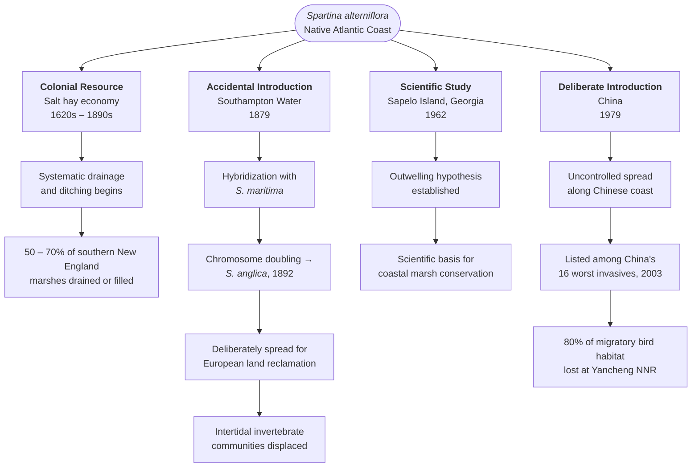
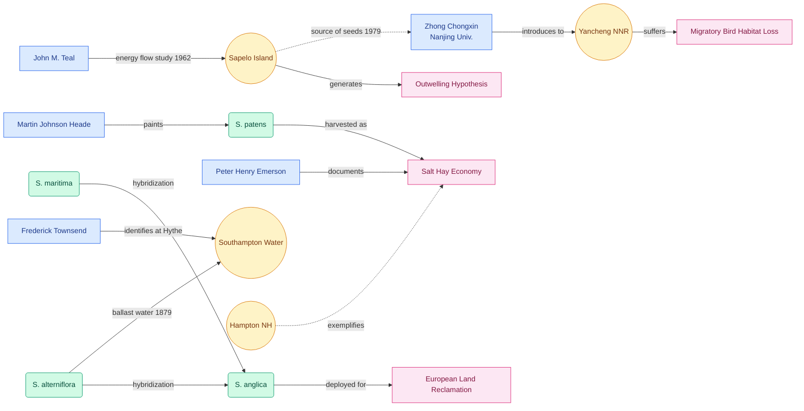

<blockquote class="prompt-info">
This narrative was written with the assistance of artificial intelligence.
</blockquote>

[*Spartina alterniflora*](Q2697224) (smooth cordgrass) is not only an ecologically significant plant. It is also a historical one — a living actor whose movements, uses, and meanings have been shaped by specific human decisions across four centuries and multiple continents. To follow *Spartina* is to follow a thread that runs from the common lands of colonial New England through the tidal mudflats of industrial England to a deliberate act of ecological engineering on China's Yellow Sea coast. It is a thread woven from ambition, miscalculation, and the recurring human tendency to see the natural world primarily as a resource waiting to be put to use.



The [salt marsh](Q29925) in which *Spartina* grows is itself a culturally produced space — altered, drained, reclaimed, romanticized, measured, and now mourned in ways that tell us as much about human history as about coastal ecology. Look at the [dense canopy of grass blades](img1/zoomto/pct:10,10,80,55) that colonial farmers cut by the ton as salt hay and shipped to market as livestock fodder. Look more closely at the [stems and leaf bases](img1/zoomto/pct:15,55,70,40), where the structural biology of the plant — its hollow oxygen-conducting channels, its salt-excreting epidermal glands — made it simultaneously useful and, wherever human ambition carried it beyond its native range, ecologically dangerous.

---

## The Settler's Marsh

When English colonists arrived on the Atlantic seaboard in the early seventeenth century, they encountered salt marshes they had not created but immediately pressed into service. The presence of a marsh was often a decisive factor in where to site a new town: it meant free hay. Harvested from the high marsh, where [*Spartina patens*](Q3492753) (saltmeadow cordgrass) grows in dense, fine-bladed mats accessible at low tide, salt hay required no cultivation, no plowing, no seed. It simply grew, and could be cut every August by crews working with scythes, the cuttings raked into windrows and stacked on wooden staddles — frameworks of posts set above the high-tide mark to keep the bales dry while the tides moved beneath them.[^1]

The marsh was commons before it was private property. In the earliest New England settlements, salt marsh lots were held collectively by the freeholders of a town and worked cooperatively. Only later, as the market economy matured, were marsh lots subdivided, fenced, and sold. The social history of the marsh tracks closely with the history of enclosure.

As colonial farming intensified, so did the physical modification of the marsh. To increase yields, farmers dug drainage ditches at twice the density of natural tidal creeks — channeling water off the high marsh to extend the growing season and expand the area of harvestable hay. Embankments were built, tidal gates installed, and thousands of acres of low marsh filled or flooded permanently to create upland pasture. By the time the salt hay economy finally collapsed in the late nineteenth century — undercut by the railroad, which delivered cheap upland hay from interior farms — an estimated fifty to seventy percent of the salt marshes present at the time of European contact in southern New England had been drained, filled, or fundamentally altered.[^1]

What remained of the native marsh was still *Spartina*. But it was *Spartina* in a landscape two centuries of human labor had transformed.



---

## The Romantic Marsh

Even as marshes were being drained and filled, artists and writers began to find them beautiful. In the middle decades of the nineteenth century — precisely the period when the salt hay economy was entering its final decline — painters and poets discovered the New England salt marsh as an aesthetic subject, and the imagery they produced did enduring cultural work.



As the historian Kimberly Sebold has documented, mid-nineteenth-century painters and writers represented the salt marsh farmer as a timeless, harmonious steward of the natural world — a figure uncorrupted by industrialization, at home in a landscape that had apparently remained unchanged since settlement.[^2] These representations did not describe the marsh so much as construct it: they projected onto a working agricultural site the values of stability, authenticity, and ecological reciprocity at the very moment those qualities were becoming nostalgic rather than real. The marsh became picturesque when it began to disappear.



📍 [Hampton, NH](map1/flyto/42.92,-70.84,13) — one of the oldest organized salt hay harvesting sites in New England, where records of common marsh lots date to the 1650s, and where the systematic ditching of the marsh through the eighteenth century exemplifies the transformation documented in the colonial record.

📍 [Sapelo Island, GA](map1/flyto/31.45,-81.27,11) — the site where, in 1961 and 1962, the ecologist John M. Teal worked systematically through the marsh to produce the first quantitative account of energy flow in a salt marsh ecosystem,[^3] transforming the marsh from a landscape and a resource into a scientific object.

📍 [Southampton Water, UK](map1/flyto/50.87,-1.38,12) — where *Spartina alterniflora* was first recorded in England in 1879, almost certainly arrived in the ballast water of transatlantic ships, and where it hybridized within a decade with the native *Spartina maritima* to produce the allopolyploid [*Spartina anglica*](Q1484698).[^4]

📍 [Yancheng, China](map1/flyto/33.38,120.70,10) — the Yellow Sea coast site of the Yancheng National Nature Reserve, where the deliberate introduction of *Spartina alterniflora* in 1979 has since eliminated an estimated eighty percent of critical migratory shorebird habitat.[^5]

---

## Science Arrives at Sapelo

The transformation of the salt marsh into a scientific object has its own history. Through most of the colonial and early industrial period, the marsh was primarily a resource to be extracted or a waste to be reclaimed. The idea that the marsh itself — its energy flows, its trophic structures, its export of organic matter — might be worth studying systematically emerged only in the mid-twentieth century, and it emerged at a specific institution in a specific place: the University of Georgia Marine Institute on [Sapelo Island](Q515603), Georgia.

John M. Teal's 1962 study measured gross primary productivity, community respiration, and the flux of organic material between marsh and adjacent tidal waters, concluding that the Georgia marshes exported a substantial fraction of their net production to coastal systems — a finding that became foundational to estuarine ecology.[^3] The paper is a landmark in the discipline. But it is also a document with a history: the decision to study the Georgia coast rather than New England, the choice to frame the marsh as an energy system rather than a community or a landscape, the particular methodology of systems ecology pioneered by Eugene Odum at the same institution — all of these shaped what the Sapelo marsh became in the scientific record.

To measure *Spartina* was to produce a new kind of knowledge about it. And that knowledge, in turn, created new obligations: if the marsh could be shown to underwrite coastal fisheries, stabilize shorelines, and sequester carbon, then its destruction could be given a monetary cost. The ecological argument for marsh conservation depended on first making the marsh legible in the language of productivity and services. Teal's paper was part of that translation.



Watch the [opening passage through a tidal creek](vid1/playat/0,60) and consider that Teal measured the organic flux in creeks like this one — carbon moving from grass to water to estuary to sea. Then move to [the open marsh at water level](vid1/playat/90), the view both the hay farmer and the ecologist would have recognized, though they would have seen entirely different things.

---

## The Accidental Passenger: Southampton Water, 1879

In 1879, the botanist Frederick Townsend identified an unfamiliar grass growing on the mudflats near Hythe, on [Southampton Water](Q502233) — the tidal estuary that served as the main southern port of England.[^4] It was *Spartina alterniflora*, almost certainly arrived in the dried mud lining the ballast tanks of ships that had loaded cargo in the Carolinas or Georgia and discharged ballast in Southampton. The plant was vigorous. In the sheltered, nutrient-rich conditions of an English estuary, it spread rapidly along the intertidal zone.

Within a decade it had encountered the native *Spartina maritima* and produced a sterile but vegetatively spreading hybrid, *Spartina* × *townsendii*, named for Townsend. In a small number of plants — the precise circumstances remain unrecorded — spontaneous chromosome doubling produced a new fertile species: [*Spartina anglica*](Q1484698), first formally collected near Lymington, Hampshire in 1892.[^4] The new hybrid was more tolerant of deep inundation than either parent and rapidly colonized lower intertidal zones that neither parent could reach. By the 1920s, land managers in the Netherlands, France, and Germany were deliberately importing *S. anglica* as a sediment-trapping tool for coastal reclamation.

An accidental introduction had been conscripted into the service of European coastal engineering. What no one anticipated was that the same productivity that made the plant useful for reclamation also made it capable of eliminating the open mudflat habitat on which hundreds of thousands of migratory and overwintering shorebirds depend. By the time systematic eradication programs began in Britain and the Netherlands in the 1980s and 1990s, the damage to intertidal invertebrate communities and bird feeding grounds was already extensive.

---

## An Act of State: China, 1979

In late 1979, researchers from Nanjing University made a deliberate decision to bring *Spartina alterniflora* to China. Their purpose was coastal defense. The Yellow Sea coast was eroding, seawalls were expensive, and the American cordgrass — famously productive, famously capable of trapping sediment and building land — seemed an elegant and inexpensive solution. Plants and seeds were collected from three sites along the United States East Coast: Morehead City, North Carolina; [Sapelo Island](Q515603), Georgia; and Tampa Bay, Florida. They were shipped to China, trialed in Fujian Province in 1981, and gradually released along thousands of kilometers of coastline.[^5]

The results exceeded every engineering expectation — and not in ways anyone welcomed. *S. alterniflora* spread faster and more aggressively than the introduction team had projected. By 2003, China's State Environmental Protection Administration had classified it among the nation's sixteen most harmful invasive species.[^5] The Yancheng National Nature Reserve on the Jiangsu coast, one of the most important staging areas on the East Asian–Australasian Flyway, had lost an estimated eighty percent of its migratory shorebird habitat to advancing Spartina monoculture. Among the species most severely affected is *Calidris pygmaea* — the spoon-billed sandpiper, a critically endangered wader that breeds on the Russian Pacific coast and depends on Yellow Sea mudflats as a refueling stop during its migration to Southeast Asian wintering grounds.[^5]

The irony is one that an essayist would hesitate to invent: the specific plants measured by Teal at Sapelo Island in 1962, and used to demonstrate the ecological productivity of salt marshes, were collected from Sapelo Island seventeen years later and shipped to China, where they became an ecological disaster now threatening species that the same tradition of science has helped us identify and value.

---

## Five Centuries of Human–Plant Relations

The four historical episodes described above share a common structure: a human actor perceives a need, identifies *Spartina* as a means of meeting it, and acts — with consequences that were never fully anticipated. The diagram below maps those branching paths.

---

## Reading the Plant

To follow *Spartina* across four centuries and three continents is to see the same grass playing irreconcilable roles in different human dramas. For colonial New Englanders it was fodder and income, a resource that organized the geography of settlement. For Romantic painters it was picturesque scenery, a vehicle for nostalgia. For Teal it was an energy system, a measurable object that could speak the language of policy. For European coastal engineers in the 1920s it was a land-building tool, a technology of reclamation. For China's coastal planners in 1979 it was a solution to erosion. For the migratory shorebirds of the Yellow Sea, and for the conservationists who monitor them, it is a threat that arrived wearing the credentials of ecology.

The plant has not changed. What changes is the framework of value and knowledge that surrounds it — and the power structures that determine who decides what the plant is for, and who bears the consequences when the decision turns out to be wrong.

A salt marsh, seen in this light, is not simply a biological community. It is a site where human histories accumulate, where the consequences of past decisions grow quietly in the mud, and where what we see when we look at the grass depends entirely on when we are standing there, and who we have been taught to be.

---

## Entity Network

The diagram below maps the major entities in this article — *Spartina* species (green), people (blue), places (amber), and historical outcomes (pink) — and the relationships that tied them together across four centuries and three continents. Solid arrows indicate direct causal or documentary relationships; dashed arrows indicate indirect or spatial connections.

---

## References

[^1]: Gedan, K. B., B. R. Silliman, and M. D. Bertness. "Centuries of human-driven change in salt marsh ecosystems." *Annual Review of Marine Science* 1 (2009): 117–141. [https://doi.org/10.1146/annurev.marine.010908.163930](https://doi.org/10.1146/annurev.marine.010908.163930)

[^2]: Sebold, K. R. "'Amid the Great Sea Meadows': Re-constructing the salt-marsh landscape through art and literature." *Maine History* 40, no. 1 (2001): 50–69. [https://digitalcommons.library.umaine.edu/mainehistoryjournal/vol40/iss1/](https://digitalcommons.library.umaine.edu/mainehistoryjournal/vol40/iss1/)

[^3]: Teal, J. M. "Energy flow in the salt marsh ecosystem of Georgia." *Ecology* 43, no. 4 (1962): 614–624. [https://doi.org/10.2307/1933451](https://doi.org/10.2307/1933451)

[^4]: Raybould, A. F., A. J. Gray, M. J. Lawrence, and D. F. Marshall. "The evolution of *Spartina anglica* C. E. Hubbard (Gramineae): origin and genetic variability." *Biological Journal of the Linnean Society* 43, no. 2 (1991): 111–126. [https://doi.org/10.1111/j.1095-8312.1991.tb00588.x](https://doi.org/10.1111/j.1095-8312.1991.tb00588.x)

[^5]: Nie, M. "Lessons from the invasion of *Spartina alterniflora* in coastal China." *Ecology* 104, no. 4 (2023): e3874. [https://doi.org/10.1002/ecy.3874](https://doi.org/10.1002/ecy.3874)
